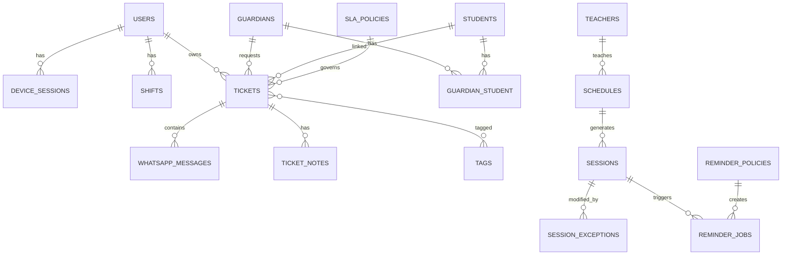

# 2. Data Model (ERD)

> **Database**: PostgreSQL 15+
> **Constraint**: No grade/level/branch/group fields anywhere. No teacher subject/level assignments.

## 2.1 Table Overview

```
users ──┬── roles (via model_has_roles, Spatie)
        ├── permissions (via role_has_permissions, Spatie)
        └── device_sessions

students ──── guardians (M2M via guardian_student)
         └── student_notes

teachers

whatsapp_messages ── whatsapp_templates
                 └── delivery_logs

tickets ──── ticket_notes
         ├── ticket_tags (M2M via ticket_tag)
         └── tags

schedules ──── sessions ──── session_exceptions

reminder_policies ──── reminder_jobs

routing_rules
sla_policies
audit_logs
```

## 2.2 Table Definitions

### users
| Column | Type | Notes |
|--------|------|-------|
| id | BIGSERIAL PK | |
| name | VARCHAR(255) | |
| email | VARCHAR(255) UNIQUE | |
| phone | VARCHAR(20) | |
| password | VARCHAR(255) | bcrypt |
| avatar_url | VARCHAR(500) NULL | |
| availability | ENUM('available','busy','unavailable') | Default: available |
| max_open_tickets | INT | Default: 20 |
| created_at / updated_at | TIMESTAMP | |
| INDEX | idx_email, idx_phone | |

> Roles managed by Spatie: `roles`, `model_has_roles`, `permissions`, `role_has_permissions`, `model_has_permissions`

### device_sessions
| Column | Type | Notes |
|--------|------|-------|
| id | BIGSERIAL PK | |
| user_id | BIGINT FK → users | |
| device_id | VARCHAR(255) | Unique device identifier |
| device_name | VARCHAR(255) | e.g. "iPhone 15 Pro" |
| fcm_token | VARCHAR(500) NULL | Push notification token |
| refresh_token | VARCHAR(500) | |
| last_active_at | TIMESTAMP | |
| expires_at | TIMESTAMP | Refresh token expiry |
| created_at | TIMESTAMP | |
| UNIQUE | (user_id, device_id) | |

### shifts
| Column | Type | Notes |
|--------|------|-------|
| id | BIGSERIAL PK | |
| user_id | BIGINT FK → users | |
| day_of_week | SMALLINT | 0=Sun … 6=Sat |
| start_time | TIME | |
| end_time | TIME | |
| is_active | BOOLEAN | Default: true |
| UNIQUE | (user_id, day_of_week) | |

### students
| Column | Type | Notes |
|--------|------|-------|
| id | BIGSERIAL PK | |
| full_name | VARCHAR(255) | |
| status | ENUM('active','paused','dropped') | Default: active |
| notes | TEXT NULL | |
| created_at / updated_at | TIMESTAMP | |
| INDEX | idx_status | |

### guardians
| Column | Type | Notes |
|--------|------|-------|
| id | BIGSERIAL PK | |
| full_name | VARCHAR(255) | |
| whatsapp_number | VARCHAR(20) UNIQUE | Primary, normalized E.164 |
| backup_number | VARCHAR(20) NULL | |
| email | VARCHAR(255) NULL | |
| created_at / updated_at | TIMESTAMP | |
| INDEX | idx_whatsapp_number | |

### guardian_student (pivot)
| Column | Type | Notes |
|--------|------|-------|
| id | BIGSERIAL PK | |
| guardian_id | BIGINT FK → guardians | |
| student_id | BIGINT FK → students | |
| relationship | VARCHAR(50) | e.g. parent, uncle |
| is_primary | BOOLEAN | Default: true |
| UNIQUE | (guardian_id, student_id) | |

### student_notes
| Column | Type | Notes |
|--------|------|-------|
| id | BIGSERIAL PK | |
| student_id | BIGINT FK → students | |
| author_id | BIGINT FK → users | |
| content | TEXT | |
| created_at | TIMESTAMP | |

### teachers
| Column | Type | Notes |
|--------|------|-------|
| id | BIGSERIAL PK | |
| full_name | VARCHAR(255) | |
| whatsapp_number | VARCHAR(20) NULL | |
| status | ENUM('active','inactive') | Default: active |
| created_at / updated_at | TIMESTAMP | |

### tags
| Column | Type | Notes |
|--------|------|-------|
| id | BIGSERIAL PK | |
| name | VARCHAR(100) UNIQUE | e.g. payment, complaint, scheduling |
| color | VARCHAR(7) | Hex color for UI |

### tickets
| Column | Type | Notes |
|--------|------|-------|
| id | BIGSERIAL PK | |
| ticket_number | VARCHAR(20) UNIQUE | Auto-generated: TKT-20260302-0001 |
| status | ENUM('new','assigned','pending','escalated','resolved','closed') | |
| priority | ENUM('low','normal','high','urgent') | Default: normal |
| owner_id | BIGINT FK → users NULL | Assigned supervisor |
| guardian_id | BIGINT FK → guardians NULL | Requester |
| student_id | BIGINT FK → students NULL | Linked student or NULL |
| category | VARCHAR(100) NULL | Derived from tags or rules |
| pending_reason | TEXT NULL | |
| resolution_reason | TEXT NULL | |
| escalation_reason | TEXT NULL | |
| escalated_by_id | BIGINT FK → users NULL | |
| escalated_at | TIMESTAMP NULL | |
| sla_policy_id | BIGINT FK → sla_policies NULL | |
| sla_first_response_at | TIMESTAMP NULL | When first response sent |
| sla_resolved_at | TIMESTAMP NULL | When resolved |
| sla_breached | BOOLEAN | Default: false |
| sticky_owner_id | BIGINT FK → users NULL | For future routing |
| follow_up_at | TIMESTAMP NULL | Internal reminder |
| created_at / updated_at | TIMESTAMP | |
| INDEX | idx_status, idx_owner, idx_guardian, idx_priority, idx_created | |

### ticket_tag (pivot)
| Column | Type | Notes |
|--------|------|-------|
| ticket_id | BIGINT FK → tickets | |
| tag_id | BIGINT FK → tags | |
| PK | (ticket_id, tag_id) | |

### ticket_notes
| Column | Type | Notes |
|--------|------|-------|
| id | BIGSERIAL PK | |
| ticket_id | BIGINT FK → tickets | |
| author_id | BIGINT FK → users | |
| content | TEXT | |
| is_internal | BOOLEAN | Default: true (not sent to WhatsApp) |
| created_at | TIMESTAMP | |

### whatsapp_messages
| Column | Type | Notes |
|--------|------|-------|
| id | BIGSERIAL PK | |
| wa_message_id | VARCHAR(255) UNIQUE | WhatsApp wamid for idempotency |
| ticket_id | BIGINT FK → tickets NULL | |
| direction | ENUM('inbound','outbound') | |
| from_number | VARCHAR(20) | |
| to_number | VARCHAR(20) | |
| message_type | ENUM('text','image','audio','video','document','template') | |
| content | TEXT NULL | Text body |
| media_url | VARCHAR(500) NULL | S3/storage URL |
| media_mime_type | VARCHAR(100) NULL | |
| template_name | VARCHAR(255) NULL | If sent as template |
| delivery_status | ENUM('scheduled','sent','delivered','read','failed') | |
| failure_reason | TEXT NULL | |
| retry_count | SMALLINT | Default: 0 |
| idempotency_key | VARCHAR(255) UNIQUE NULL | For outbound dedupe |
| sent_by_id | BIGINT FK → users NULL | Supervisor who sent |
| timestamp | TIMESTAMP | WhatsApp timestamp |
| created_at | TIMESTAMP | |
| INDEX | idx_wa_message_id, idx_ticket, idx_direction, idx_from, idx_timestamp | |

### whatsapp_templates
| Column | Type | Notes |
|--------|------|-------|
| id | BIGSERIAL PK | |
| name | VARCHAR(255) UNIQUE | Template name as registered with BSP |
| language | VARCHAR(10) | e.g. ar, en |
| category | VARCHAR(100) | e.g. reminder, follow_up, greeting |
| body_template | TEXT | With {{1}} placeholders |
| header_type | ENUM('none','text','image','document') NULL | |
| status | ENUM('approved','pending','rejected') | |
| created_at / updated_at | TIMESTAMP | |

### schedules
| Column | Type | Notes |
|--------|------|-------|
| id | BIGSERIAL PK | |
| title | VARCHAR(255) | Session label/name |
| student_id | BIGINT FK → students NULL | Per-student schedule |
| class_entity_id | BIGINT FK → class_entities NULL | Per-group schedule |
| teacher_id | BIGINT FK → teachers | |
| day_of_week | SMALLINT | 0–6 |
| start_time | TIME | |
| end_time | TIME | |
| is_online | BOOLEAN | Default: false |
| meeting_link | VARCHAR(500) NULL | For online sessions |
| location | VARCHAR(255) NULL | For offline sessions |
| status | ENUM('active','paused','stopped') | Default: active |
| created_at / updated_at | TIMESTAMP | |
| INDEX | idx_teacher, idx_student, idx_day | |

### class_entities (generic grouping — NOT grade/branch/group)
| Column | Type | Notes |
|--------|------|-------|
| id | BIGSERIAL PK | |
| name | VARCHAR(255) | e.g. "Morning Group A", "Weekend Class" |
| description | TEXT NULL | |
| created_at / updated_at | TIMESTAMP | |

### class_entity_student (pivot)
| Column | Type | Notes |
|--------|------|-------|
| class_entity_id | BIGINT FK → class_entities | |
| student_id | BIGINT FK → students | |
| PK | (class_entity_id, student_id) | |

### sessions
| Column | Type | Notes |
|--------|------|-------|
| id | BIGSERIAL PK | |
| schedule_id | BIGINT FK → schedules | |
| session_date | DATE | |
| start_time | TIME | |
| end_time | TIME | |
| teacher_id | BIGINT FK → teachers | |
| status | ENUM('upcoming','done','postponed','cancelled') | Default: upcoming |
| is_exception | BOOLEAN | Default: false (true if manually modified) |
| created_at / updated_at | TIMESTAMP | |
| UNIQUE | (schedule_id, session_date) | Prevent duplicates |
| INDEX | idx_date, idx_teacher, idx_status | |

### session_exceptions
| Column | Type | Notes |
|--------|------|-------|
| id | BIGSERIAL PK | |
| session_id | BIGINT FK → sessions | |
| exception_type | ENUM('cancel','reschedule','time_change') | |
| original_date | DATE | |
| new_date | DATE NULL | For reschedule |
| new_start_time | TIME NULL | |
| new_end_time | TIME NULL | |
| reason | TEXT NULL | |
| created_by_id | BIGINT FK → users | |
| created_at | TIMESTAMP | |

### reminder_policies
| Column | Type | Notes |
|--------|------|-------|
| id | BIGSERIAL PK | |
| name | VARCHAR(255) | e.g. "30min before session" |
| trigger_minutes_before | INT | e.g. 30, 0 |
| target | ENUM('parent','teacher','both') | |
| template_id | BIGINT FK → whatsapp_templates | |
| is_enabled | BOOLEAN | Default: true |
| created_at / updated_at | TIMESTAMP | |

### reminder_jobs
| Column | Type | Notes |
|--------|------|-------|
| id | BIGSERIAL PK | |
| reminder_policy_id | BIGINT FK → reminder_policies | |
| session_id | BIGINT FK → sessions | |
| scheduled_at | TIMESTAMP | When to send |
| recipient_number | VARCHAR(20) | |
| recipient_type | ENUM('parent','teacher') | |
| status | ENUM('pending','sent','delivered','failed') | |
| failure_reason | TEXT NULL | |
| retry_count | SMALLINT | Default: 0 |
| idempotency_key | VARCHAR(255) UNIQUE | `reminder:{policy_id}:{session_id}:{recipient}` |
| sent_at | TIMESTAMP NULL | |
| created_at | TIMESTAMP | |
| INDEX | idx_scheduled_at, idx_status | |

### routing_rules
| Column | Type | Notes |
|--------|------|-------|
| id | BIGSERIAL PK | |
| name | VARCHAR(255) | |
| algorithm | ENUM('round_robin','least_load','tag_based','time_based') | |
| priority | INT | Rule evaluation order |
| conditions | JSONB | `{"tags":["payment"],"time_range":"09:00-17:00"}` |
| target_user_ids | JSONB | `[1,2,3]` supervisor IDs |
| is_active | BOOLEAN | Default: true |
| created_at / updated_at | TIMESTAMP | |

### sla_policies
| Column | Type | Notes |
|--------|------|-------|
| id | BIGSERIAL PK | |
| name | VARCHAR(255) | |
| tag_match | VARCHAR(100) | Tag that triggers this SLA |
| first_response_minutes | INT | SLA for first response |
| resolution_minutes | INT | SLA for resolution |
| warning_threshold_pct | INT | e.g. 80 = warn at 80% of time elapsed |
| auto_escalate | BOOLEAN | Default: false |
| created_at / updated_at | TIMESTAMP | |

### delivery_logs
| Column | Type | Notes |
|--------|------|-------|
| id | BIGSERIAL PK | |
| message_id | BIGINT FK → whatsapp_messages NULL | |
| reminder_job_id | BIGINT FK → reminder_jobs NULL | |
| status | ENUM('scheduled','sent','delivered','read','failed') | |
| bsp_response | JSONB NULL | Raw BSP response |
| failure_reason | TEXT NULL | |
| attempted_at | TIMESTAMP | |

### audit_logs
| Column | Type | Notes |
|--------|------|-------|
| id | BIGSERIAL PK | |
| user_id | BIGINT FK → users NULL | |
| action | VARCHAR(100) | e.g. ticket.assigned, message.sent |
| auditable_type | VARCHAR(100) | Polymorphic: App\Models\Ticket |
| auditable_id | BIGINT | |
| old_values | JSONB NULL | Before state |
| new_values | JSONB NULL | After state |
| ip_address | VARCHAR(45) NULL | |
| user_agent | VARCHAR(500) NULL | |
| created_at | TIMESTAMP | Immutable — no updated_at |
| INDEX | idx_user, idx_auditable, idx_action, idx_created | |

## 2.3 Key Relationships Summary


